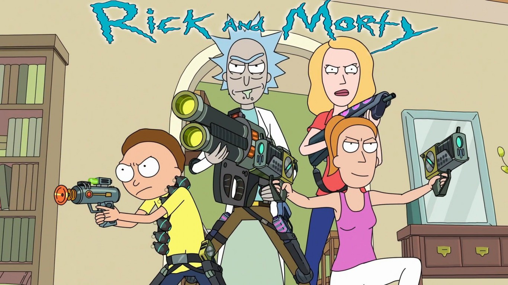
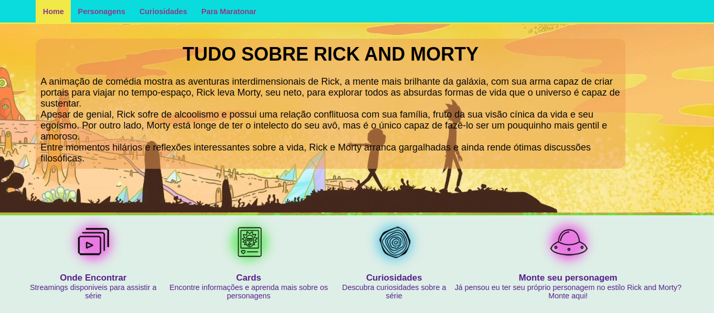
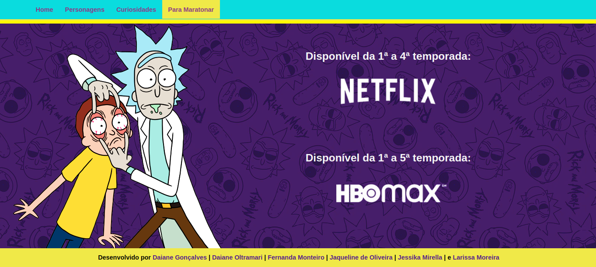

# Rick and Morty Lovers

## Índice

- [1. Resumo do Projeto](#1-resumo-do-projeto)
- [2. Definição do Projeto](#2-definição-do-projeto)
- [3. Interface anterior do projeto](#3-interface-anterior-do-projeto)
- [4. Interface atual do projeto](#4-interface-atual-do-projeto)
- [5. Histórias de usuários](#6-histórias-de-usuários)
- [6. Testes de Usabilidade](#7-testes-de-usabilidade)
- [7. Tecnologias Utilizadas](#8-tecnologias-utilizadas)
- [8. Considerações](#9-considerações)

---

## Sobre Rick and Morty

[Rick and Morty](https://pt.wikipedia.org/wiki/Rick_and_Morty) é uma série de animação adulta norte-americana de comédia e ficção científica criada por Justin Roiland e Dan Harmon para o bloco de programação noturno Adult Swim, exibido no canal Cartoon Network.

É uma das animações mais insanas e viciantes produzidas até hoje. Criado inicialmente como uma paródia animada do filme [_De Volta para o Futuro_](https://pt.wikipedia.org/wiki/Back_to_the_Future), as aventuras do cientista louco, excêntrico e alcoólatra Rick e seu neto Morty que é facílmente influenciável por ele, conquistou diversos fãs ao redor do mundo.

Rick é um cientista alcoólatra de 70 anos extremamente inteligente que foi morar com a família de sua filha Beth, uma cirurgiã cardíaca de equinos. Ele está sempre em busca de grandes experiências e divide seu tempo entre desenvolver projetos altamente tecnológicos em seu laboratório (garagem da casa da Beth), e em levar seu neto de 14 anos Morty em aventuras perigosas e surreais, indo parar até em diversas dimensões e realidades paralelas. Ele é bem esquentado e sempre sobra para seu neto, Morty, que o acompanha nessas expedições. Combinados com tensões preexistentes dentro da família, esses eventos causam ao sensível Morty muita angústia em casa e na escola.

## 1. Resumo do projeto.

**_Rick and Morty Lovers_** foi um novo desafio lançado no Bootcamp do <Laboratória>, onde nos reunimos em squads e tínhamos como desafio escolhermos um determinado projeto de alguma das integrantes e implementarmos melhorias, buscamos então, um projeto que já gostávamos e implementamos várias outras funcionalidades legais que continham nos outros projetos das outras colegas do squad, visando juntar em um só site, o melhor conteúdo para entretenimento do nosso público.

## 2. Definição do Projeto.

A princípio o site foi desenvolvido para que o usuário pudesse navegar de forma simples e prática, dando destaque aos cards dos personagens e as informações mais relevantes que o usuário deseja encontrar, conforme os estudos realizados através das pesquisas e levantamento das _Histórias de usuários_, já disponibilizada no projeto. Devido a série possuir muitos personagens, e cada um deles com diferentes características, visamos que através dos filtros implementados, a busca ficaria mais fácil e rápida, facilitando também a escolha de quais episódios desejam assistir.

Implementamos também, a página de _CURIOSIDADES_ que através de nossas pesquisas de usuário, identificamos que era uma parte bastante relevante para eles. Assim como a página _PARA MARATONAR_ e o link _Monte o seu personagem_ que direciona nossos usuário para um site muito bacana onde é possível montar mesmo seu personagem nesse mundo muito louco do universo Rick and Morty.a de quais episódios desejam assistir.

## 3. Interface anterior do projeto

Essa era a primeira interface do projeto.

## 4. Interface atual do projeto

No projeto atual, na página de personagens, implementamos um campo onde o usuário tem a opção de pesquisar pelo nome do personagem, acrescentamos também um terceiro botão de seleção com o gênero dos personagens, ampliando as suas ações de pesquisa, incluímos também, um botão para limpar os campos de pesquisas, para que o usuário possa fazer uma outra pesquisa começando do zero.

Nos cards, incluímos a informação de quais epsódios cada personagem aparece, facilitando para que o usuário possa escolher qual epsódio assistir, baseado na aparição de determinado personagem.

Melhoramos a página Home, onde fala um pouquinho mais sobre o que é a série e seus personagens, temos também a inclusão da página de Curiosidades e também da página Para Maratonar, além de toda uma restruturação e repaginação da página.

#### Página Home:

#### Página Personagens:

#### Página Curiosidades:

#### Página Para Maratonar:

## 5. Histórias de usuários.

**1**. "O usuário que está assistindo a série, gostaria de saber mais sobre os personagens, e em quais episódios eles aparecem, para que assim possam escolher melhor quais episódios assistirem".

#### Critérios de aceitação:
- [x] Ver os personagens em cards.
- [x] Ver as informações de cada personagem assim como os episódios em que aparecem.

**2**. "O usuário deseja ver em cards o(s) personagem(ns) conforme a sua espécie, gênero, ou status".

#### Critérios de aceitação:
- [x] O usuário consegue filtrar por espécie, gênero e status.

**3**. "O usuário quer ver na tela o card com a imagem e as informações do(s) personagem(ns) conforme digita o nome do personagem e também em ordem crescente e decrescente".

#### Critérios de aceitação:
- [x] O usuário pode pesquisar personagens por nome e ver os cards com as informações do mesmo.
- [x] O usuário consegue ordenar para ver os personagens em ordem crescente e decrescente.

**4**. "O usuário quer ver na tela a informação de quantos personagens representa determinado filtro e a sua porcentagem em relação ao total de personagens da série".

#### Critérios de aceitação:
- [x] O usuário consegue ver uma curiosidade conforme o filtro realizado, mostrando o total dos personagens e a média que representa determinado filtro.

#### Definição de pronto:
- [x] Passar em 100% nos testes.
- [x] Padrão de código: ";" ao final da linha de código e aspas duplas.
- [x] Sem comentários.
- [x] Subir pro github.
- [x] Sem conflitos/bugs.

## 6. Testes de usabilidade.
Foram realizados testes de usabilidades com pessoas de diferentes faixas etárias:

***Usuários adultos na faixa de idade de 36-45 anos:***
- Gostaria de ver as imagens dos personagens e as principais informações deles já nos cards, inclusive em quais epsódios eles aparecem.

Solução: Colocamos as principais informações na frente do card junto com o nome e a imagem do personagem.

***Usuários jovens na faixa de idade de 26-35 anos:***
- Gostariam de saber quais canais é possível assistir os epsódios da série.

Solução: Criamos uma página Para Maratonar que direciona os usuários para as páginas oficiais da série.

***Usuários jovens na faixa de idade de 18-25 anos:***
- Gostariam de ver as curiosidades sobre a série, de forma simples e rápida.

Solução: Criamos uma página Curiosidades que leva o usuário pra dentro da dimensão do Rick and Morty e os permite descobrir as curiosidades da série.
E na página Home, criamos um link que leva o usuário á um site muito divertido que permite que eles próprios criem diversos avatares com características dos personagens da série.

## 7. Tecnologias Utilizadas.
- HTML 5
- CSS3
- JavaScript Vanilla
- Node.js
- Git
- GitHub
- GitHUb Pages
- Jest

## 8. Considerações.

A refatoração desse código que deu essa nova cara no site foi desenvolvida por

[_Daiane Gonçalves_](https://github.com/daianeex)

[_Daiane Oltramari_](https://github.com/daianeoltramari)

[_Fernanda Monteiro_](https://github.com/Fe-Monteiro)

[_Jaqueline Oliveira_](https://github.com/jaquelinedeoliveira93)

[_Jéssika Mirella_](https://github.com/JessikaMirella)

[_Larissa Moreira_](https://github.com/la4ri)

Esse desafio que foi baseado em cima de nosso segundo projeto do Bootcamp e nos ensinou sobre:
- Manipulação do DOM, Objetos e Array;
- Funções;
- Desenvolvimento de testes unitários;
- Responsividade;
- UX Design;
- Cálculo agregado;
- GitHub;
- Eslint;
- Aprender a aprender;

Agradecemos por esse grande desafio, pela parceria das colegas do <strong>Squad Dimension 007</strong>, mentoras e psicólogas.
